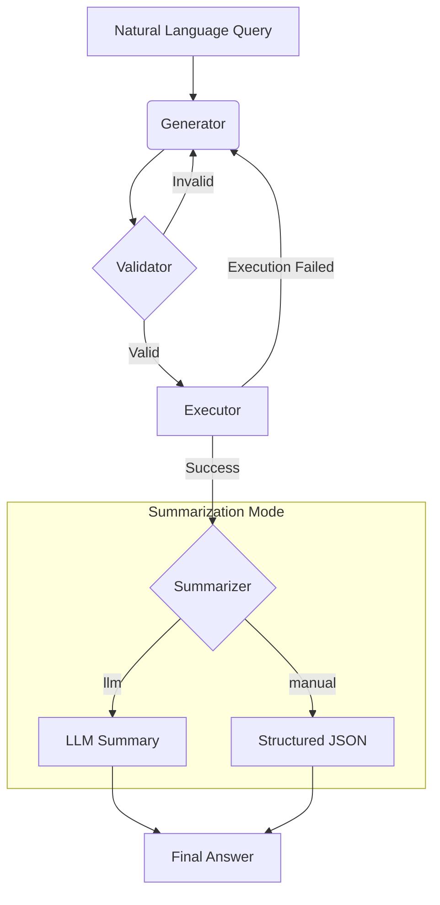
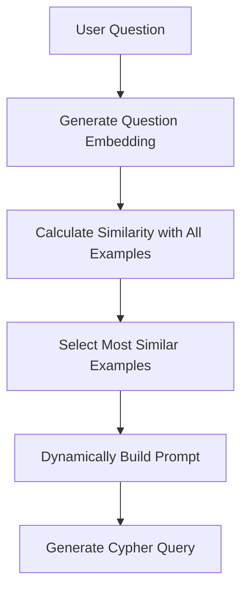
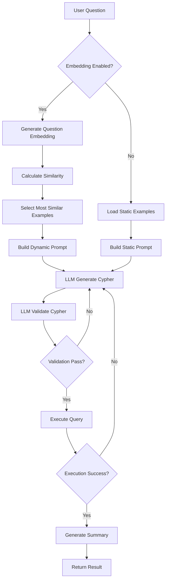
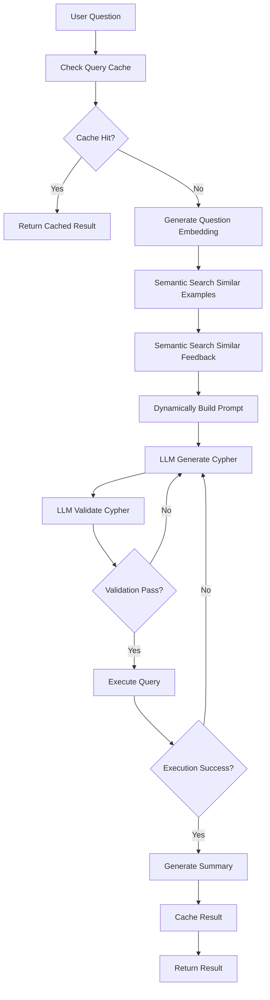

[中文](./README.md)

# Service Topology Agent with LangGraph

This project implements an intelligent agent using LangChain and LangGraph that understands natural language questions about **service topology**, converts them into Cypher queries, executes them against a Neo4j database, and returns a user-friendly result.

The agent is designed with a modular architecture, making it easy to extend and maintain.

## Core Features

- **Natural Language to Cypher**: Translates questions like "Which services depend on the API gateway?" into precise Cypher queries.
- **Two-Stage Validation**:
    1.  **LLM Pre-Validation**: An LLM checks the generated Cypher for syntax errors before execution.
    2.  **Database Execution**: The query is run against Neo4j, which serves as the ultimate validator.
- **Automatic Retries**: If either validation or execution fails, the agent attempts to correct the query automatically, retrying up to 3 times.
- **Dual Summarization Modes**:
    - **`llm` mode**: Provides a natural language summary of the results, perfect for human users.
    - **`manual` mode**: Formats the results into a structured JSON object, ideal for frontend applications or other programs.

## Run Modes

The agent supports multiple run modes to accommodate different use cases:

- **Standard Mode (`standard`)**:
  - Includes complete LLM validation step
  - Performs syntax checking before executing Cypher queries
  - Provides higher accuracy and reliability
  - Suitable for production environments and scenarios requiring high precision

- **Fast Mode (`fast`)**:
  - Skips LLM validation step
  - Goes directly from generator to executor
  - Significantly improves response speed
  - Suitable for development testing and scenarios requiring fast response

You can set the default mode via the `DEFAULT_RUN_MODE` environment variable, or dynamically specify it via the `run_mode` parameter in each API call.

## Workflow

The agent follows a robust, multi-step process to ensure accuracy and provide a great user experience.



## System Architecture

The project is organized into a modular structure for clarity and scalability:

- `app.py`: The main Flask web service entry point.
- `agent.py`: The core `Text2CypherAgent` class that assembles and orchestrates all components.
- `agent_state.py`: Defines the shared `GraphState` for the entire workflow.
- `nodes/`: Contains individual, single-responsibility nodes for the graph.
    - `cypher_generator.py`: Generates the initial Cypher query (LLM 1).
    - `cypher_validator.py`: Validates the query's syntax (LLM 2).
    - `query_executor.py`: Executes the query against Neo4j.
    - `summarizer_node.py`: Summarizes results using an LLM.
    - `manual_summarizer_node.py`: Formats results using predefined logic.
    - `enhanced_cypher_generator.py`: Enhanced generator with dynamic example selection and caching.
- `tools/`: Holds clients for external services.
    - `llm_client.py`: Initializes the connection to the OpenAI API.
    - `neo4j_client.py`: Manages the connection to the Neo4j database.
    - `embedding_client.py`: Handles text embedding generation and similarity calculation.
- `prompts/`: Manages all prompt-related logic.
    - `prompt_manager.py`: Loads and formats prompt templates and examples, supports static example management.
    - `enhanced_prompt_manager.py`: Enhanced prompt manager with dynamic example selection and semantic search.
- `database/`: Database management components.
    - `db_manager.py`: Manages SQLite database operations for feedback and interaction logs.
    - `vector_db_manager.py`: Manages vector database for embedding storage and semantic search.
- `examples.json`: Stores few-shot examples for the prompt, making it easy to improve the agent without changing code.

### Example System Architecture

The example system adopts a layered architecture design supporting multiple example management strategies:

```
┌─────────────────────────────────────────────────────────────┐
│                Example System Architecture                   │
├─────────────────────────────────────────────────────────────┤
│  User Layer                                                  │
│  ┌─────────────┐  ┌─────────────┐  ┌─────────────┐          │
│  │ Static       │  │ Dynamic     │  │ User        │          │
│  │ Examples     │  │ Examples    │  │ Feedback    │          │
│  │ examples.json│  │ embedding   │  │ /feedback   │          │
│  └─────────────┘  └─────────────┘  └─────────────┘          │
├─────────────────────────────────────────────────────────────┤
│  Management Layer                                            │
│  ┌─────────────┐  ┌─────────────┐  ┌─────────────┐          │
│  │PromptManager│  │Enhanced     │  │VectorDB     │          │
│  │Static       │  │PromptManager│  │Manager      │          │
│  │Example Mgmt │  │Dynamic      │  │Vector       │          │
│  └─────────────┘  └─────────────┘  └─────────────┘          │
├─────────────────────────────────────────────────────────────┤
│  Storage Layer                                               │
│  ┌─────────────┐  ┌─────────────┐  ┌─────────────┐          │
│  │ examples.json│  │ feedback.db │  │ vector.db   │          │
│  │ Predefined  │  │ User        │  │ Embedding   │          │
│  │ Examples    │  │ Feedback    │  │ Vectors     │          │
│  └─────────────┘  └─────────────┘  └─────────────┘          │
└─────────────────────────────────────────────────────────────┘
```

**Core Component Descriptions**:

1. **Static Example Management** (`examples.json` + `PromptManager`):
   - Provides stable base example collection
   - Supports rapid iteration and testing
   - Updates without code modification

2. **Dynamic Example Selection** (`EnhancedPromptManager` + `VectorDBManager`):
   - Intelligent example selection based on semantic similarity
   - Supports real-time example optimization
   - Provides personalized example recommendations

3. **User Feedback System** (`DBManager` + Feedback API):
   - Collects user-corrected Cypher queries
   - Automatically learns from high-quality feedback
   - Implements online model optimization

4. **Vector Database** (`VectorDBManager`):
   - Stores text embedding vectors
   - Supports semantic similarity search
   - Provides query caching functionality

## Setup Instructions

### 1. Environment Setup

It is recommended to use a virtual environment.

```bash
# Create a virtual environment
python -m venv venv

# Activate it
# On macOS/Linux:
source venv/bin/activate
# On Windows:
.\\venv\\Scripts\\activate
```

### 2. Install Dependencies

```bash
pip install -r requirements.txt
```

### 3. Configure Environment Variables

Create a `.env` file in the project's root directory by copying `.env.example`. Then, fill in your OpenAI and Neo4j credentials.

```
# .env file

# OpenAI API Key
OPENAI_API_KEY="your_openai_api_key"

# Neo4j Credentials
NEO4J_URI="bolt://localhost:7687"
NEO4J_USERNAME="neo4j"
NEO4J_PASSWORD="your_neo4j_password"

# Optional: Enable interaction logging for data collection
ENABLE_INTERACTION_LOGGING="false"

# Optional: Default run mode (standard or fast)
# - standard: Includes validation step for better accuracy
# - fast: Skips validation for faster execution
DEFAULT_RUN_MODE="standard"

# Optional: Summarizer type (llm or manual)
SUMMARIZER_TYPE="llm"

# Optional: Enable embedding-related features
ENABLE_EMBEDDINGS="true"
# Optional: Enable query caching
ENABLE_CACHE="true"
# Optional: Default similarity calculation method (cosine, euclidean, manhattan, dot_product, pearson, spearman, jaccard, hamming)
DEFAULT_SIMILARITY_METHOD="cosine"
```
**Note**: Ensure your Neo4j database is running and accessible.

## How to Run

This project is packaged as a Flask web service and is recommended to be run with Gunicorn for production.

### 1. Start the Service

A convenience script is provided. Run the following commands in the project's root directory:

```bash
# First, make the script executable (only needs to be done once)
chmod +x run.sh

# Then, start the service
./run.sh
```
The service will start on `http://0.0.0.0:5000`. You can modify the host, port, worker count, and other settings in `gunicorn_config.py`.

Alternatively, you can run Gunicorn directly:
```bash
gunicorn --config gunicorn_config.py app:app
```

### 2. Interact with the Agent via API

You can use any HTTP client (like `curl`, Postman, or Python's `requests` library) to interact with the agent.

#### `/chat` Endpoint

This is the core endpoint for conversation.

- **URL**: `/chat`
- **Method**: `POST`
- **Body (JSON)**:
  ```json
  {
    "question": "What is your question?",
    "session_id": "unique_session_id_optional",
    "run_mode": "run_mode_optional"
  }
  ```
  * The `session_id` field is optional. If provided, all interactions with the same ID will be associated; if not provided, the system will automatically generate a new ID for this interaction.
  * The `run_mode` field is optional and can override the default run mode:
    - `"standard"`: Standard mode, includes LLM validation step for better accuracy
    - `"fast"`: Fast mode, skips validation step for faster execution
    - If not provided, will use the default mode configured in the `DEFAULT_RUN_MODE` environment variable

- **Example `curl` commands**:
  ```bash
  # Standard mode (default)
  curl -X POST http://localhost:5000/chat \
       -H "Content-Type: application/json" \
       -d '{
             "question": "Which services does the api-gateway depend on?",
             "session_id": "",
             "run_mode": "standard"
           }'
  
  # Fast mode
  curl -X POST http://localhost:5000/chat \
       -H "Content-Type: application/json" \
       -d '{
             "question": "Which services does the api-gateway depend on?",
             "session_id": "",
             "run_mode": "fast"
           }'
  ```

#### `/feedback` Endpoint

Used to submit user feedback to improve the model.

- **URL**: `/feedback`
- **Method**: `POST`
- **Body (JSON)**:
  ```json
  {
      "question": "The user's original question",
      "generated_cypher": "The agent's incorrect Cypher",
      "correct_cypher": "The user's corrected Cypher",
      "rating": 1
  }
  ```

## Enhanced API Endpoints (Embedding-related)

All enhanced APIs are exposed with the `/enhanced/` prefix.

#### `/enhanced/chat` Endpoint
- **Function**: Supports embedding intelligent example selection, feedback recall, and query caching.
- **URL**: `/enhanced/chat`
- **Method**: `POST`
- **Body (JSON)**:
  ```json
  {
    "query": "What is your question?",
    "history": [],
    "run_mode": "standard",
    "similarity_method": "cosine"
  }
  ```
- **Returns**: In addition to the original fields, includes `cache_hit`, `cache_similarity`, `prompt_metadata`, and other embedding-related information.

#### `/enhanced/similar-examples` Endpoint
- **Function**: Returns the most similar few-shot examples for the input question.
- **URL**: `/enhanced/similar-examples`
- **Method**: `POST`
- **Body (JSON)**:
  ```json
  { "question": "What is your question?", "top_k": 5, "method": "cosine" }
  ```
- **Returns**: `similar_examples` list with similarity scores.

#### `/enhanced/similar-feedback` Endpoint
- **Function**: Returns the most similar historical user feedback for the input question.
- **URL**: `/enhanced/similar-feedback`
- **Method**: `POST`
- **Body (JSON)**:
  ```json
  { "question": "What is your question?", "top_k": 3, "method": "cosine" }
  ```
- **Returns**: `similar_feedback` list with similarity scores.

#### `/enhanced/set-similarity-method` Endpoint
- **Function**: Dynamically change the similarity method for the agent.
- **URL**: `/enhanced/set-similarity-method`
- **Method**: `POST`
- **Body (JSON)**:
  ```json
  { "method": "euclidean" }
  ```
- **Returns**: Confirmation message with the new similarity method.

#### `/enhanced/cache-stats` Endpoint
- **Function**: Query embedding query cache hit rates, most common questions, and other statistics.
- **URL**: `/enhanced/cache-stats`
- **Method**: `GET`

#### `/enhanced/initialize-embeddings` Endpoint
- **Function**: Batch generate embedding vectors for existing examples and feedback (use after first deployment or data migration).
- **URL**: `/enhanced/initialize-embeddings`
- **Method**: `POST`

## Embedding Enhancement System

This system integrates OpenAI embedding APIs to implement advanced AI capabilities:

- **Intelligent Example Selection**: Automatically retrieves the most similar few-shot examples for each Cypher generation, dynamically improving generation quality.
- **Semantic Feedback Recall**: Automatically recalls historical user feedback most similar to the current question, assisting model correction.
- **Query Caching**: Directly reuses historical Cypher and results for similar questions, significantly improving response speed.
- **Semantic Search**: Supports similarity search for arbitrary text, facilitating knowledge discovery and recommendation.
- **Professional Similarity Calculation**: Supports 8 different similarity calculation methods to adapt to different scenario requirements.

### Similarity Calculation Methods

The system supports the following 8 professional similarity calculation methods:

#### 1. Cosine Similarity ⭐ Recommended
- **Principle**: Calculates the cosine value of the angle between two vectors
- **Use Cases**: Text similarity calculation, high-dimensional vector comparison
- **Advantages**: Insensitive to vector length, high computational efficiency, stable results
- **Configuration**: `DEFAULT_SIMILARITY_METHOD="cosine"`

#### 2. Euclidean Distance
- **Principle**: Calculates the straight-line distance between two vectors
- **Use Cases**: Spatial distance calculation, numerical feature comparison
- **Configuration**: `DEFAULT_SIMILARITY_METHOD="euclidean"`

#### 3. Manhattan Distance
- **Principle**: Calculates the Manhattan distance (L1 norm) between two vectors
- **Use Cases**: Sparse vector comparison, high computational efficiency requirements
- **Configuration**: `DEFAULT_SIMILARITY_METHOD="manhattan"`

#### 4. Dot Product
- **Principle**: Inner product of two vectors
- **Use Cases**: Raw similarity calculation, preserving directional information
- **Configuration**: `DEFAULT_SIMILARITY_METHOD="dot_product"`

#### 5. Pearson Correlation
- **Principle**: Calculates the linear correlation between two vectors
- **Use Cases**: Linear relationship analysis, statistical correlation
- **Configuration**: `DEFAULT_SIMILARITY_METHOD="pearson"`

#### 6. Spearman Correlation
- **Principle**: Rank-based correlation coefficient
- **Use Cases**: Non-linear relationships, outlier handling
- **Configuration**: `DEFAULT_SIMILARITY_METHOD="spearman"`

#### 7. Jaccard Similarity
- **Principle**: Calculates the ratio of intersection to union of two sets
- **Use Cases**: Sparse vectors, set similarity
- **Configuration**: `DEFAULT_SIMILARITY_METHOD="jaccard"`

#### 8. Hamming Distance
- **Principle**: Calculates the number of different bits between two binary vectors
- **Use Cases**: Binary vectors, hash comparison
- **Configuration**: `DEFAULT_SIMILARITY_METHOD="hamming"`

### Performance Optimization

- **FAISS Acceleration**: Large-scale vector search (>100 candidates) automatically uses FAISS acceleration
- **Scikit-learn Batch Processing**: Medium-scale search (10-100 candidates) uses sklearn optimization
- **Smart Caching**: Avoids duplicate API calls, improves efficiency
- **Batch Processing**: Processes multiple queries simultaneously, reduces latency

### How It Works
- All examples, feedback, and historical questions are automatically generated as embedding vectors and stored in the local database.
- Each time a user asks a question, the system performs semantic retrieval using embeddings to dynamically select the most relevant few-shot examples and feedback.
- Query caching automatically hits high-similarity questions and directly returns historical results.
- The system automatically selects the optimal similarity calculation algorithm based on data scale.

### Usage Examples

```bash
# Intelligent conversation (automatic embedding enhancement)
curl -X POST http://localhost:5001/enhanced/chat \
     -H "Content-Type: application/json" \
     -d '{"query": "Which services does the api-gateway depend on?", "history": []}'

# Conversation with specified similarity method
curl -X POST http://localhost:5001/enhanced/chat \
     -H "Content-Type: application/json" \
     -d '{"query": "Which services does the api-gateway depend on?", "history": [], "similarity_method": "euclidean"}'

# Query most similar examples (specify method)
curl -X POST http://localhost:5001/enhanced/similar-examples \
     -H "Content-Type: application/json" \
     -d '{"question": "Which services does the api-gateway depend on?", "top_k": 3, "method": "manhattan"}'

# Query most similar feedback (specify method)
curl -X POST http://localhost:5001/enhanced/similar-feedback \
     -H "Content-Type: application/json" \
     -d '{"question": "Which services does the api-gateway depend on?", "top_k": 2, "method": "pearson"}'

# Dynamically switch similarity method
curl -X POST http://localhost:5001/enhanced/set-similarity-method \
     -H "Content-Type: application/json" \
     -d '{"method": "euclidean"}'

# Query cache statistics
curl -X GET http://localhost:5001/enhanced/cache-stats

# Initialize all embeddings (execute once after first deployment or migration)
curl -X POST http://localhost:5001/enhanced/initialize-embeddings
```

### Important Notes
- Embedding features are enabled by default. Set `ENABLE_EMBEDDINGS=false` to disable.
- After first deployment or migration, it's recommended to call the `/enhanced/initialize-embeddings` endpoint first.
- Embedding-related APIs run on port 5001 (separate from main API).
- Embedding API calls consume OpenAI credits, please plan accordingly.
- Different similarity methods are suitable for different scenarios. Choose the appropriate method based on data characteristics.
- Cosine similarity is the default recommended method, suitable for most text similarity calculation scenarios.

## Example System Usage Guide

This system employs a multi-layered example management mechanism to continuously improve agent performance through `examples.json` files and user feedback systems.

#### 1. Static Example Management (`examples.json`)

The `examples.json` file stores predefined few-shot examples used to guide LLM generation of accurate Cypher queries.

**File Structure**:
```json
[
  {
    "natural_language": "Which services does the 'api-gateway' depend on?",
    "cypher": "MATCH (s:Service {name: 'api-gateway'})-[:DEPENDS_ON]->(dependency:Service) RETURN dependency.name AS dependencies"
  },
  {
    "natural_language": "List all instances for the 'user-service'.",
    "cypher": "MATCH (i:Instance)-[:INSTANCE_OF]->(s:Service {name: 'user-service'}) RETURN i.id AS instance_id, i.ip_address AS ip, i.status AS status"
  }
]
```

**Usage Flow**:
1. **Loading Phase**: `PromptManager` automatically loads the `examples.json` file at system startup
2. **Formatting Phase**: Examples are formatted into text suitable for LLM understanding
3. **Injection Phase**: Formatted examples are injected into the prompt template
4. **Generation Phase**: LLM generates new Cypher queries based on these examples

**Advantages**:
- Update examples without modifying code
- Provide stable base example collection
- Support rapid iteration and testing

#### 2. Dynamic Example Selection (Enhanced Mode)

In Enhanced mode, the system uses embedding technology to implement intelligent example selection:

**Workflow**:


**API Endpoints**:
- `/enhanced/similar-examples`: Query examples most similar to the question
- `/enhanced/initialize-embeddings`: Initialize embedding vectors for all examples

**Usage Examples**:
```bash
# Query similar examples
curl -X POST http://localhost:5001/enhanced/similar-examples \
     -H "Content-Type: application/json" \
     -d '{"question": "Which services does the api-gateway depend on?", "top_k": 3}'

# Initialize embeddings (execute after first deployment)
curl -X POST http://localhost:5001/enhanced/initialize-embeddings
```

#### 3. User Feedback System

The system implements online learning through user feedback to continuously improve example quality:

**Feedback Flow**:
1. **Submit Feedback**: Users submit corrected Cypher via `/feedback` endpoint
2. **Quality Assessment**: System evaluates feedback quality based on rating (1-5 points)
3. **Automatic Learning**: High-quality feedback (4-5 points) automatically joins the example library
4. **Immediate Effect**: New feedback takes effect immediately without service restart

**Feedback Data Structure**:
```json
{
    "question": "User's original question",
    "generated_cypher": "Agent's incorrect Cypher",
    "correct_cypher": "User's corrected Cypher",
    "rating": 5
}
```

**API Usage**:
```bash
curl -X POST http://localhost:5000/feedback \
     -H "Content-Type: application/json" \
     -d '{
       "question": "Which services does the api-gateway depend on?",
       "generated_cypher": "MATCH (s:Service)-[:DEPENDS_ON]->(d:Service) RETURN d.name",
       "correct_cypher": "MATCH (s:Service {name: \"api-gateway\"})-[:DEPENDS_ON]->(d:Service) RETURN d.name",
       "rating": 5
     }'
```

#### 4. Example Optimization Strategies

**Example Selection Strategies**:
- **Static Mode**: Use all examples from `examples.json`
- **Dynamic Mode**: Select most relevant examples based on semantic similarity
- **Hybrid Mode**: Supplement static examples when dynamic examples are insufficient

**Example Quality Improvement**:
- Regularly analyze user feedback to identify common error patterns
- Adjust example coverage based on actual usage
- Validate example effectiveness through A/B testing

**Best Practices**:
1. **Diversity**: Ensure examples cover different types of query patterns
2. **Accuracy**: Regularly verify example correctness
3. **Simplicity**: Keep examples concise and clear, avoid over-complexity
4. **Practicality**: Build examples based on real user questions

#### 5. Monitoring and Analysis

**Key Metrics**:
- Example usage frequency and effectiveness
- User feedback rating distribution
- Query success rate changes
- Response time optimization effects

**Analysis Tools**:
```bash
# Query cache statistics (includes example usage)
curl -X GET http://localhost:5001/enhanced/cache-stats

# View similar feedback (understand user correction patterns)
curl -X POST http://localhost:5001/enhanced/similar-feedback \
     -H "Content-Type: application/json" \
     -d '{"question": "Your question", "top_k": 5}'
```

#### 6. Complete Workflow

Below is the complete workflow from user question to final result:

**Standard Mode Workflow**:


**Enhanced Mode Workflow**:


**Example Selection Strategy Comparison**:

| Feature | Static Mode | Dynamic Mode | Enhanced Mode |
|---------|-------------|--------------|---------------|
| Example Source | examples.json | All examples | All examples + feedback |
| Selection Method | Fixed order | Semantic similarity | Semantic similarity + cache |
| Response Speed | Fast | Medium | Fastest (cache) |
| Accuracy | Stable | Higher | Highest |
| Personalization | None | Yes | Strong |
| Maintenance Cost | Low | Medium | Medium |

**Practical Usage Examples**:

1. **Static Mode** (Standard API):
```bash
curl -X POST http://localhost:5000/chat \
     -H "Content-Type: application/json" \
     -d '{"question": "Which services does the api-gateway depend on?"}'
```

2. **Dynamic Mode** (Enhanced API):
```bash
curl -X POST http://localhost:5001/enhanced/chat \
     -H "Content-Type: application/json" \
     -d '{"query": "Which services does the api-gateway depend on?", "history": []}'
```

3. **Feedback Submission**:
```bash
curl -X POST http://localhost:5000/feedback \
     -H "Content-Type: application/json" \
     -d '{
       "question": "Which services does the api-gateway depend on?",
       "generated_cypher": "MATCH (s:Service)-[:DEPENDS_ON]->(d:Service) RETURN d.name",
       "correct_cypher": "MATCH (s:Service {name: \"api-gateway\"})-[:DEPENDS_ON]->(d:Service) RETURN d.name",
       "rating": 5
     }'
```

**Performance Optimization Recommendations**:

1. **Example Quantity Control**: Recommend keeping example count between 5-10 to avoid overly long prompts
2. **Similarity Threshold**: In dynamic mode, recommend setting similarity threshold ≥0.7 to ensure example relevance
3. **Cache Strategy**: Enabling query cache can significantly improve response speed
4. **Regular Cleanup**: Periodically clean low-quality feedback to maintain example library quality

## Improving the Agent

### Interaction Logging

You can enable interaction logging by setting the environment variable `ENABLE_INTERACTION_LOGGING=true`.

When this feature is enabled, every successful call to the `/chat` endpoint will automatically log the **question**, **generated Cypher**, and **final summary** to the `interaction_logs` table in the `feedback.db` database. This data is crucial for future model fine-tuning, evaluation, and mining new example cases.

### User Feedback

When a user submits high-quality feedback (a rating of 4 or 5) via the `/feedback` endpoint, it is **automatically saved into `feedback.db` (an SQLite database)**.

Upon receiving new feedback, the service **automatically reloads the agent**, incorporating all high-quality feedback from the database as new "real-world examples" into its prompt. This enables true **Online Learning**, allowing the agent to evolve and improve immediately after receiving feedback, without requiring a restart. 