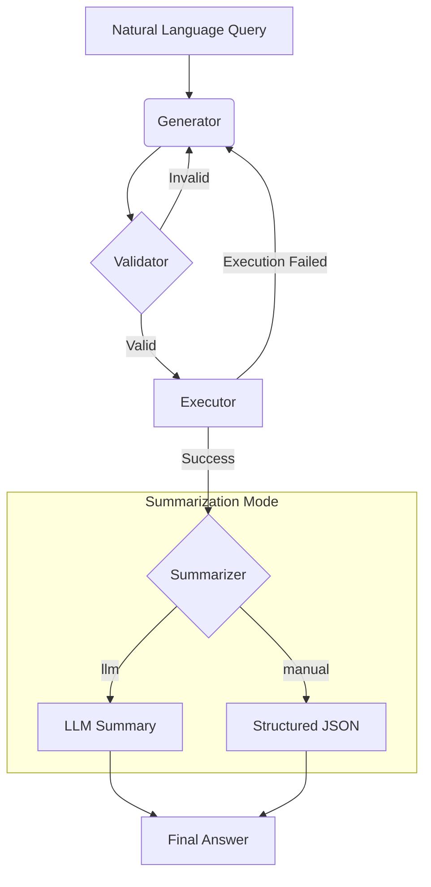

[中文](./README.md)

# Service Topology Agent with LangGraph

This project implements an intelligent agent using LangChain and LangGraph that understands natural language questions about **service topology**, converts them into Cypher queries, executes them against a Neo4j database, and returns a user-friendly result.

The agent is designed with a modular architecture, making it easy to extend and maintain.

## Core Features

- **Natural Language to Cypher**: Translates questions like "Which services depend on the API gateway?" into precise Cypher queries.
- **Two-Stage Validation**:
    1.  **LLM Pre-Validation**: An LLM checks the generated Cypher for syntax errors before execution.
    2.  **Database Execution**: The query is run against Neo4j, which serves as the ultimate validator.
- **Automatic Retries**: If either validation or execution fails, the agent attempts to correct the query automatically, retrying up to 3 times.
- **Dual Summarization Modes**:
    - **`llm` mode**: Provides a natural language summary of the results, perfect for human users.
    - **`manual` mode**: Formats the results into a structured JSON object, ideal for frontend applications or other programs.

## Run Modes

The agent supports multiple run modes to accommodate different use cases:

- **Standard Mode (`standard`)**:
  - Includes complete LLM validation step
  - Performs syntax checking before executing Cypher queries
  - Provides higher accuracy and reliability
  - Suitable for production environments and scenarios requiring high precision

- **Fast Mode (`fast`)**:
  - Skips LLM validation step
  - Goes directly from generator to executor
  - Significantly improves response speed
  - Suitable for development testing and scenarios requiring fast response

You can set the default mode via the `DEFAULT_RUN_MODE` environment variable, or dynamically specify it via the `run_mode` parameter in each API call.

## Workflow

The agent follows a robust, multi-step process to ensure accuracy and provide a great user experience.



## System Architecture

The project is organized into a modular structure for clarity and scalability:

- `app.py`: The main Flask web service entry point.
- `agent.py`: The core `Text2CypherAgent` class that assembles and orchestrates all components.
- `agent_state.py`: Defines the shared `GraphState` for the entire workflow.
- `nodes/`: Contains individual, single-responsibility nodes for the graph.
    - `cypher_generator.py`: Generates the initial Cypher query (LLM 1).
    - `cypher_validator.py`: Validates the query's syntax (LLM 2).
    - `query_executor.py`: Executes the query against Neo4j.
    - `summarizer_node.py`: Summarizes results using an LLM.
    - `manual_summarizer_node.py`: Formats results using predefined logic.
- `tools/`: Holds clients for external services.
    - `llm_client.py`: Initializes the connection to the OpenAI API.
    - `neo4j_client.py`: Manages the connection to the Neo4j database.
- `prompts/`: Manages all prompt-related logic.
    - `prompt_manager.py`: Loads and formats prompt templates and examples.
- `database/`: Database management components.
    - `db_manager.py`: Manages SQLite database operations for feedback and interaction logs.
- `examples.json`: Stores few-shot examples for the prompt, making it easy to improve the agent without changing code.

## Setup Instructions

### 1. Environment Setup

It is recommended to use a virtual environment.

```bash
# Create a virtual environment
python -m venv venv

# Activate it
# On macOS/Linux:
source venv/bin/activate
# On Windows:
.\\venv\\Scripts\\activate
```

### 2. Install Dependencies

```bash
pip install -r requirements.txt
```

### 3. Configure Environment Variables

Create a `.env` file in the project's root directory by copying `.env.example`. Then, fill in your OpenAI and Neo4j credentials.

```
# .env file

# OpenAI API Key
OPENAI_API_KEY="your_openai_api_key"

# Neo4j Credentials
NEO4J_URI="bolt://localhost:7687"
NEO4J_USERNAME="neo4j"
NEO4J_PASSWORD="your_neo4j_password"

# Optional: Enable interaction logging for data collection
ENABLE_INTERACTION_LOGGING="false"

# Optional: Default run mode (standard or fast)
# - standard: Includes validation step for better accuracy
# - fast: Skips validation for faster execution
DEFAULT_RUN_MODE="standard"

# Optional: Summarizer type (llm or manual)
SUMMARIZER_TYPE="llm"
```
**Note**: Ensure your Neo4j database is running and accessible.

## How to Run

This project is packaged as a Flask web service and is recommended to be run with Gunicorn for production.

### 1. Start the Service

A convenience script is provided. Run the following commands in the project's root directory:

```bash
# First, make the script executable (only needs to be done once)
chmod +x run.sh

# Then, start the service
./run.sh
```
The service will start on `http://0.0.0.0:5000`. You can modify the host, port, worker count, and other settings in `gunicorn_config.py`.

Alternatively, you can run Gunicorn directly:
```bash
gunicorn --config gunicorn_config.py app:app
```

### 2. Interact with the Agent via API

You can use any HTTP client (like `curl`, Postman, or Python's `requests` library) to interact with the agent.

#### `/chat` Endpoint

This is the core endpoint for conversation.

- **URL**: `/chat`
- **Method**: `POST`
- **Body (JSON)**:
  ```json
  {
    "question": "What is your question?",
    "session_id": "unique_session_id_optional",
    "run_mode": "run_mode_optional"
  }
  ```
  * The `session_id` field is optional. If provided, all interactions with the same ID will be associated; if not provided, the system will automatically generate a new ID for this interaction.
  * The `run_mode` field is optional and can override the default run mode:
    - `"standard"`: Standard mode, includes LLM validation step for better accuracy
    - `"fast"`: Fast mode, skips validation step for faster execution
    - If not provided, will use the default mode configured in the `DEFAULT_RUN_MODE` environment variable

- **Example `curl` commands**:
  ```bash
  # Standard mode (default)
  curl -X POST http://localhost:5000/chat \
       -H "Content-Type: application/json" \
       -d '{
             "question": "Which services does the api-gateway depend on?",
             "session_id": "",
             "run_mode": "standard"
           }'
  
  # Fast mode
  curl -X POST http://localhost:5000/chat \
       -H "Content-Type: application/json" \
       -d '{
             "question": "Which services does the api-gateway depend on?",
             "session_id": "",
             "run_mode": "fast"
           }'
  ```

#### `/feedback` Endpoint

Used to submit user feedback to improve the model.

- **URL**: `/feedback`
- **Method**: `POST`
- **Body (JSON)**:
  ```json
  {
      "question": "The user's original question",
      "generated_cypher": "The agent's incorrect Cypher",
      "correct_cypher": "The user's corrected Cypher",
      "rating": 1
  }
  ```

## Improving the Agent

### Interaction Logging

You can enable interaction logging by setting the environment variable `ENABLE_INTERACTION_LOGGING=true`.

When this feature is enabled, every successful call to the `/chat` endpoint will automatically log the **question**, **generated Cypher**, and **final summary** to the `interaction_logs` table in the `feedback.db` database. This data is crucial for future model fine-tuning, evaluation, and mining new example cases.

### User Feedback

When a user submits high-quality feedback (a rating of 4 or 5) via the `/feedback` endpoint, it is **automatically saved into `feedback.db` (an SQLite database)**.

Upon receiving new feedback, the service **automatically reloads the agent**, incorporating all high-quality feedback from the database as new "real-world examples" into its prompt. This enables true **Online Learning**, allowing the agent to evolve and improve immediately after receiving feedback, without requiring a restart. 