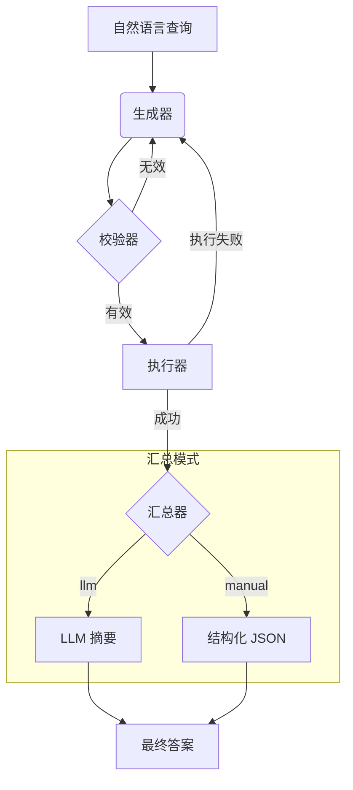

[English](./README.en.md)

# 服务拓扑智能体 (基于 LangGraph)

本项目使用 LangChain 和 LangGraph 实现了一个智能体，它能理解关于**服务拓扑**的自然语言问题，将其转换为 Cypher 查询语句，在 Neo4j 数据库中执行，并返回对用户友好的结果。

该智能体采用模块化架构设计，易于扩展和维护。

## 核心功能

- **自然语言转 Cypher**: 将"API 网关依赖哪些服务？"这类问题，精准翻译为 Cypher 查询。
- **两阶段校验**:
    1.  **LLM 预校验**: 在执行前，由一个 LLM 对生成的 Cypher 进行语法检查。
    2.  **数据库执行**: 查询在 Neo4j 中运行，将其作为最终的校验器。
- **自动重试**: 如果校验或执行失败，智能体会自动尝试修正查询，最多重试 3 次。
- **双汇总模式**:
    - **`llm` 模式**: 对结果提供自然语言摘要，非常适合人类用户阅读。
    - **`manual` 模式**: 将结果格式化为结构化的 JSON 对象，是前端应用或其他程序的理想选择。

## 运行模式

智能体支持多种运行模式，以满足不同的使用场景：

- **标准模式 (`standard`)**：
  - 包含完整的 LLM 校验步骤
  - 在执行 Cypher 查询前进行语法检查
  - 提供更高的准确性和可靠性
  - 适合生产环境和需要高精度的场景

- **快速模式 (`fast`)**：
  - 跳过 LLM 校验步骤
  - 直接从生成器到执行器
  - 显著提升响应速度
  - 适合开发测试和需要快速响应的场景

您可以通过环境变量 `DEFAULT_RUN_MODE` 设置默认模式，或在每次 API 调用时通过 `run_mode` 参数动态指定。

## 工作流

智能体遵循一个健壮的多步骤流程，以确保结果的准确性和良好的用户体验。



## 系统架构

项目采用模块化结构，以实现清晰性和可扩展性：

- `app.py`: Flask Web 服务的主入口。
- `agent.py`: 核心的 `Text2CypherAgent` 类，负责组装和调度所有组件。
- `agent_state.py`: 为整个工作流定义共享的 `GraphState`。
- `nodes/`: 包含图中各个独立的、单一职责的节点。
    - `cypher_generator.py`: 生成初始 Cypher 查询 (LLM 1)。
    - `cypher_validator.py`: 校验查询语法 (LLM 2)。
    - `query_executor.py`: 在 Neo4j 中执行查询。
    - `summarizer_node.py`: 使用 LLM 对结果进行汇总。
    - `manual_summarizer_node.py`: 使用预定义逻辑格式化结果。
- `tools/`: 存放用于与外部服务交互的客户端。
    - `llm_client.py`: 初始化与 OpenAI API 的连接。
    - `neo4j_client.py`: 管理与 Neo4j 数据库的连接。
- `prompts/`: 管理所有与 `prompt` 相关的逻辑。
    - `prompt_manager.py`: 加载并格式化 `prompt` 模板和示例。
- `database/`: 数据库管理组件。
    - `db_manager.py`: 管理 SQLite 数据库操作，包括反馈和交互日志。
- `examples.json`: 存储用于 `prompt` 的 few-shot 示例，使得在不修改代码的情况下提升智能体性能变得简单。

## 安装与配置

### 1. 环境设置

建议使用 Python 虚拟环境。

```bash
# 创建虚拟环境
python -m venv venv

# 激活虚拟环境
# 在 macOS/Linux 上:
source venv/bin/activate
# 在 Windows 上:
.\\venv\\Scripts\\activate
```

### 2. 安装依赖

```bash
pip install -r requirements.txt
```

### 3. 配置环境变量

在项目根目录中，通过复制 `.env.example` 来创建一个 `.env` 文件，然后填入您的 OpenAI 和 Neo4j 凭证。

```
# .env 文件

# OpenAI API 密钥
OPENAI_API_KEY="your_openai_api_key"

# Neo4j 数据库凭证
NEO4J_URI="bolt://localhost:7687"
NEO4J_USERNAME="neo4j"
NEO4J_PASSWORD="your_neo4j_password"

# 可选：启用交互日志功能用于数据收集
ENABLE_INTERACTION_LOGGING="false"

# 可选：默认运行模式 (standard 或 fast)
# - standard: 包含校验步骤，提供更好的准确性
# - fast: 跳过校验步骤，提供更快的执行速度
DEFAULT_RUN_MODE="standard"

# 可选：汇总器类型 (llm 或 manual)
SUMMARIZER_TYPE="llm"
```
**注意**: 请确保您的 Neo4j 数据库正在运行且可以访问。

## 如何运行

本项目已封装为 Flask Web 服务，并推荐使用 Gunicorn 作为生产环境的服务器。

### 1. 启动服务

我们提供了一个便捷的启动脚本。在项目根目录运行以下命令：

```bash
# 首先，为脚本添加可执行权限 (仅需执行一次)
chmod +x run.sh

# 然后，启动服务
./run.sh
```
服务将在 `http://0.0.0.0:5000` 上启动。您可以在 `gunicorn_config.py` 中修改主机、端口和工作进程数等详细配置。

或者，您也可以直接使用 `gunicorn` 命令启动：
```bash
gunicorn --config gunicorn_config.py app:app
```

### 2. 通过 API 与智能体交互

您可以使用任何 HTTP 客户端 (如 `curl`, Postman, 或者 Python `requests` 库) 与智能体进行交互。

#### `/chat` 端点

这是进行对话的核心端点。

- **URL**: `/chat`
- **Method**: `POST`
- **Body (JSON)**:
  ```json
  {
    "question": "你的问题是什么?",
    "session_id": "唯一会话ID (可选)",
    "run_mode": "运行模式 (可选)"
  }
  ```
  * `session_id` 字段是可选的。如果提供，属于同一 ID 的所有交互会被关联起来；如果不提供，系统会自动为本次交互生成一个新的 ID。
  * `run_mode` 字段是可选的，用于覆盖默认运行模式：
    - `"standard"`: 标准模式，包含 LLM 校验步骤，提供更好的准确性
    - `"fast"`: 快速模式，跳过校验步骤，提供更快的执行速度
    - 如果不提供，将使用环境变量 `DEFAULT_RUN_MODE` 中配置的默认模式

- **示例 `curl` 命令**:
  ```bash
  # 标准模式（默认）
  curl -X POST http://localhost:5000/chat \
       -H "Content-Type: application/json" \
       -d '{
             "question": "api-gateway 依赖哪些服务?",
             "session_id": "",
             "run_mode": "standard"
           }'
  
  # 快速模式
  curl -X POST http://localhost:5000/chat \
       -H "Content-Type: application/json" \
       -d '{
             "question": "api-gateway 依赖哪些服务?",
             "session_id": "",
             "run_mode": "fast"
           }'
  ```

#### `/feedback` 端点

用于提交用户反馈以改进模型。

- **URL**: `/feedback`
- **Method**: `POST`
- **Body (JSON)**:
  ```json
  {
      "question": "用户的原始问题",
      "generated_cypher": "智能体生成的错误 Cypher",
      "correct_cypher": "用户修正后的正确 Cypher",
      "rating": 1
  }
  ```

## 如何改进智能体

### 交互日志

您可以通过设置环境变量 `ENABLE_INTERACTION_LOGGING=true` 来开启交互日志功能。

当该功能开启时，每一次对 `/chat` 端点的成功调用，其**问题**、**生成的 Cypher** 和**最终摘要**都会被自动记录到 `feedback.db` 数据库的 `interaction_logs` 表中。这些数据对于后续进行模型微调、评估和挖掘新的 `example` 案例至关重要。

### 用户反馈

当用户通过 `/feedback` 端点提交了评分为 4 或 5 的高质量反馈后，该反馈会被**自动存入 `feedback.db` (一个 SQLite 数据库)**。

当服务收到新的反馈时，它会**自动重新加载 Agent**，并将数据库中所有高分反馈作为新的"真实世界示例"注入到 `prompt` 中。这实现了真正的**在线学习（Online Learning）**，使智能体能够在接收到反馈后立即自我进化，无需重启服务。 