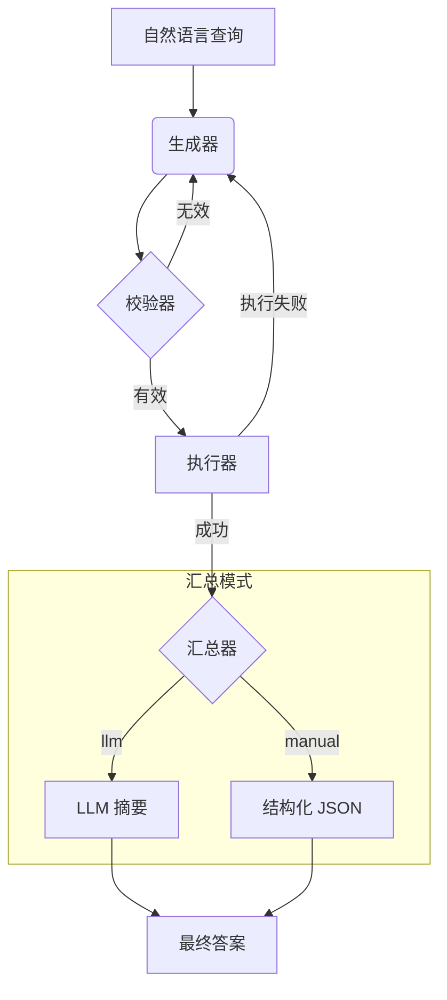

[English](./README.en.md)

# 服务拓扑智能体 (基于 LangGraph)

本项目使用 LangChain 和 LangGraph 实现了一个智能体，它能理解关于**服务拓扑**的自然语言问题，将其转换为 Cypher 查询语句，在 Neo4j 数据库中执行，并返回对用户友好的结果。

该智能体采用模块化架构设计，易于扩展和维护。

## 核心功能

- **自然语言转 Cypher**: 将“API 网关依赖哪些服务？”这类问题，精准翻译为 Cypher 查询。
- **两阶段校验**:
    1.  **LLM 预校验**: 在执行前，由一个 LLM 对生成的 Cypher 进行语法检查。
    2.  **数据库执行**: 查询在 Neo4j 中运行，将其作为最终的校验器。
- **自动重试**: 如果校验或执行失败，智能体会自动尝试修正查询，最多重试 3 次。
- **双汇总模式**:
    - **`llm` 模式**: 对结果提供自然语言摘要，非常适合人类用户阅读。
    - **`manual` 模式**: 将结果格式化为结构化的 JSON 对象，是前端应用或其他程序的理想选择。

## 工作流

智能体遵循一个健壮的多步骤流程，以确保结果的准确性和良好的用户体验。



## 系统架构

项目采用模块化结构，以实现清晰性和可扩展性：

- `main.py`: 应用程序的主入口。
- `agent.py`: 核心的 `Text2CypherAgent` 类，负责组装和调度所有组件。
- `agent_state.py`: 为整个工作流定义共享的 `GraphState`。
- `nodes/`: 包含图中各个独立的、单一职责的节点。
    - `cypher_generator.py`: 生成初始 Cypher 查询 (LLM 1)。
    - `cypher_validator.py`: 校验查询语法 (LLM 2)。
    - `query_executor.py`: 在 Neo4j 中执行查询。
    - `summarizer_node.py`: 使用 LLM 对结果进行汇总。
    - `manual_summarizer_node.py`: 使用预定义逻辑格式化结果。
- `tools/`: 存放用于与外部服务交互的客户端。
    - `llm_client.py`: 初始化与 OpenAI API 的连接。
    - `neo4j_client.py`: 管理与 Neo4j 数据库的连接。
- `prompts/`: 管理所有与 `prompt` 相关的逻辑。
    - `prompt_manager.py`: 加载并格式化 `prompt` 模板和示例。
- `examples.json`: 存储用于 `prompt` 的 few-shot 示例，使得在不修改代码的情况下提升智能体性能变得简单。

## 安装与配置

### 1. 环境设置

建议使用 Python 虚拟环境。

```bash
# 创建虚拟环境
python -m venv venv

# 激活虚拟环境
# 在 macOS/Linux 上:
source venv/bin/activate
# 在 Windows 上:
.\\venv\\Scripts\\activate
```

### 2. 安装依赖

```bash
pip install -r requirements.txt
```

### 3. 配置环境变量

在项目根目录中，通过复制 `.env.example` 来创建一个 `.env` 文件，然后填入您的 OpenAI 和 Neo4j 凭证。

```
# .env 文件

# OpenAI API 密钥
OPENAI_API_KEY="your_openai_api_key"

# Neo4j 数据库凭证
NEO4J_URI="bolt://localhost:7687"
NEO4J_USERNAME="neo4j"
NEO4J_PASSWORD="your_neo4j_password"
```
**注意**: 请确保您的 Neo4j 数据库正在运行且可以访问。

## 如何运行

1.  **选择汇总器模式**: 打开 `main.py` 文件，将 `summarizer_choice` 变量设置为 `'llm'` 或 `'manual'`.
2.  **运行脚本**:

    ```bash
    python main.py
    ```

您可以修改 `main.py` 中的 `natural_language_query` 变量，来提出您自己关于服务拓扑的问题。

## 如何改进智能体

要提升智能体的准确性，您无需修改代码。只需在 `examples.json` 文件中添加更多高质量的“自然语言 -> Cypher”示例对即可。智能体会在下次运行时自动将它们用于 `prompt` 中。 