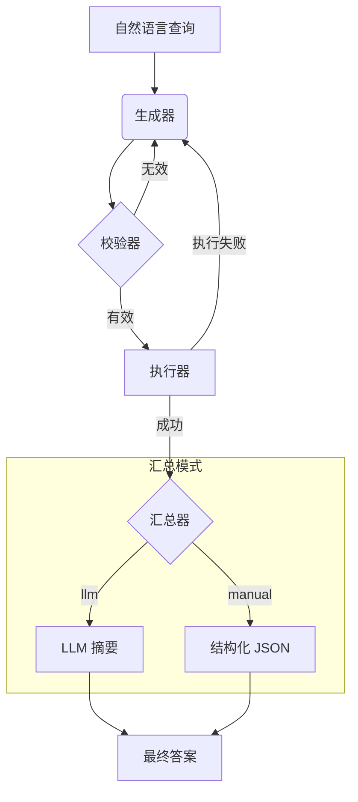
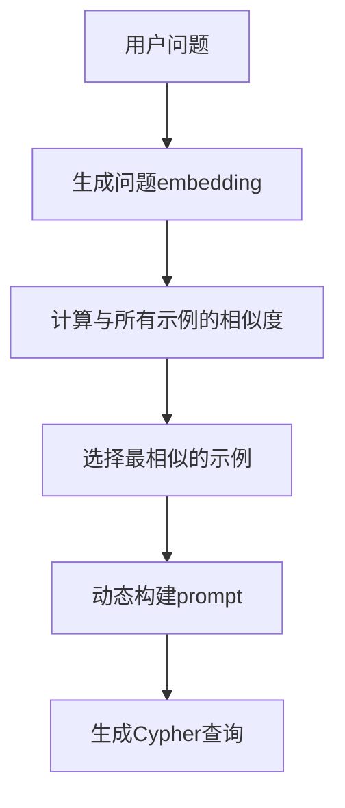
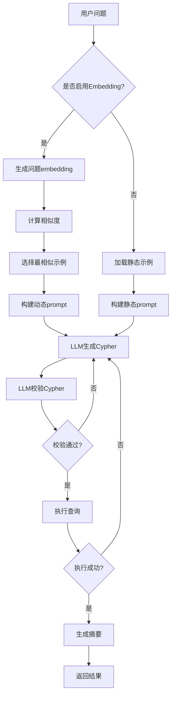
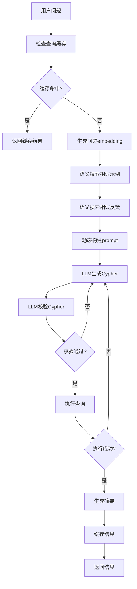

[English](./README.en.md)

# 服务拓扑智能体 (基于 LangGraph)

本项目使用 LangChain 和 LangGraph 实现了一个智能体，它能理解关于**服务拓扑**的自然语言问题，将其转换为 Cypher 查询语句，在 Neo4j 数据库中执行，并返回对用户友好的结果。

该智能体采用模块化架构设计，易于扩展和维护。

## 核心功能

- **自然语言转 Cypher**: 将"API 网关依赖哪些服务？"这类问题，精准翻译为 Cypher 查询。
- **两阶段校验**:
    1.  **LLM 预校验**: 在执行前，由一个 LLM 对生成的 Cypher 进行语法检查。
    2.  **数据库执行**: 查询在 Neo4j 中运行，将其作为最终的校验器。
- **自动重试**: 如果校验或执行失败，智能体会自动尝试修正查询，最多重试 3 次。
- **双汇总模式**:
    - **`llm` 模式**: 对结果提供自然语言摘要，非常适合人类用户阅读。
    - **`manual` 模式**: 将结果格式化为结构化的 JSON 对象，是前端应用或其他程序的理想选择。
- **访问日志记录**: 详细记录每次API调用的来源信息、响应时间和用户代理等数据。
- **Embedding增强系统**：集成OpenAI embedding接口，实现如下高级能力：
    - **智能示例选择**：根据用户问题自动检索最相关的few-shot示例，动态提升生成质量。
    - **语义反馈召回**：自动召回与当前问题最相似的历史用户反馈，辅助模型修正。
    - **查询缓存**：对相似问题直接复用历史Cypher和结果，大幅提升响应速度。
    - **语义检索**：支持任意文本的相似性搜索，助力知识发现与推荐。

## 运行模式

智能体支持多种运行模式，以满足不同的使用场景：

- **标准模式 (`standard`)**：
  - 包含完整的 LLM 校验步骤
  - 在执行 Cypher 查询前进行语法检查
  - 提供更高的准确性和可靠性
  - 适合生产环境和需要高精度的场景

- **快速模式 (`fast`)**：
  - 跳过 LLM 校验步骤
  - 直接从生成器到执行器
  - 显著提升响应速度
  - 适合开发测试和需要快速响应的场景

您可以通过环境变量 `DEFAULT_RUN_MODE` 设置默认模式，或在每次 API 调用时通过 `run_mode` 参数动态指定。

## 工作流

智能体遵循一个健壮的多步骤流程，以确保结果的准确性和良好的用户体验。



## 系统架构

项目采用模块化结构，以实现清晰性和可扩展性：

- `app.py`: Flask Web 服务的主入口。
- `agent.py`: 核心的 `Text2CypherAgent` 类，负责组装和调度所有组件。
- `agent_state.py`: 为整个工作流定义共享的 `GraphState`。
- `nodes/`: 包含图中各个独立的、单一职责的节点。
    - `cypher_generator.py`: 生成初始 Cypher 查询 (LLM 1)。
    - `cypher_validator.py`: 校验查询语法 (LLM 2)。
    - `query_executor.py`: 在 Neo4j 中执行查询。
    - `summarizer_node.py`: 使用 LLM 对结果进行汇总。
    - `manual_summarizer_node.py`: 使用预定义逻辑格式化结果。
    - `enhanced_cypher_generator.py`: 增强版生成器，支持动态示例选择和缓存。
- `tools/`: 存放用于与外部服务交互的客户端。
    - `llm_client.py`: 初始化与 OpenAI API 的连接。
    - `neo4j_client.py`: 管理与 Neo4j 数据库的连接。
    - `embedding_client.py`: 处理文本embedding生成和相似度计算。
- `prompts/`: 管理所有与 `prompt` 相关的逻辑。
    - `prompt_manager.py`: 加载并格式化 `prompt` 模板和示例，支持静态示例管理。
    - `enhanced_prompt_manager.py`: 增强版prompt管理器，支持动态示例选择和语义搜索。
- `database/`: 数据库管理组件。
    - `db_manager.py`: 管理 SQLite 数据库操作，包括反馈和交互日志。
    - `vector_db_manager.py`: 管理向量数据库，支持embedding存储和语义搜索。
- `examples.json`: 存储用于 `prompt` 的 few-shot 示例，使得在不修改代码的情况下提升智能体性能变得简单。

### 示例系统架构

示例系统采用分层架构设计，支持多种示例管理策略：

```
┌─────────────────────────────────────────────────────────────┐
│                    示例系统架构                              │
├─────────────────────────────────────────────────────────────┤
│  用户层                                                      │
│  ┌─────────────┐  ┌─────────────┐  ┌─────────────┐          │
│  │  静态示例    │  │  动态示例    │  │  用户反馈    │          │
│  │ examples.json│  │ embedding   │  │ /feedback   │          │
│  └─────────────┘  └─────────────┘  └─────────────┘          │
├─────────────────────────────────────────────────────────────┤
│  管理层                                                      │
│  ┌─────────────┐  ┌─────────────┐  ┌─────────────┐          │
│  │PromptManager│  │Enhanced     │  │VectorDB     │          │
│  │静态示例管理  │  │PromptManager│  │Manager      │          │
│  └─────────────┘  └─────────────┘  └─────────────┘          │
├─────────────────────────────────────────────────────────────┤
│  存储层                                                      │
│  ┌─────────────┐  ┌─────────────┐  ┌─────────────┐          │
│  │ examples.json│  │ feedback.db │  │ vector.db   │          │
│  │ 预定义示例   │  │ 用户反馈     │  │ embedding   │          │
│  └─────────────┘  └─────────────┘  └─────────────┘          │
└─────────────────────────────────────────────────────────────┘
```

**核心组件说明**:

1. **静态示例管理** (`examples.json` + `PromptManager`):
   - 提供稳定的基础示例集合
   - 支持快速迭代和测试
   - 无需修改代码即可更新

2. **动态示例选择** (`EnhancedPromptManager` + `VectorDBManager`):
   - 基于语义相似度智能选择示例
   - 支持实时示例优化
   - 提供个性化示例推荐

3. **用户反馈系统** (`DBManager` + 反馈API):
   - 收集用户修正的Cypher查询
   - 自动学习高质量反馈
   - 实现在线模型优化

4. **向量数据库** (`VectorDBManager`):
   - 存储文本embedding向量
   - 支持语义相似度搜索
   - 提供查询缓存功能

## 安装与配置

### 1. 环境设置

建议使用 Python 虚拟环境。

```bash
# 创建虚拟环境
python -m venv venv

# 激活虚拟环境
# 在 macOS/Linux 上:
source venv/bin/activate
# 在 Windows 上:
.\\venv\\Scripts\\activate
```

### 2. 安装依赖

```bash
pip install -r requirements.txt
```

> 依赖说明：
> - 本系统 embedding 功能依赖 `numpy`，已在 requirements.txt 中自动包含。

### 3. 配置环境变量

在项目根目录中，通过复制 `.env.example` 来创建一个 `.env` 文件，然后填入您的 OpenAI 和 Neo4j 凭证。

```
# .env 文件

# OpenAI API 密钥
OPENAI_API_KEY="your_openai_api_key"

# Neo4j 数据库凭证
NEO4J_URI="bolt://localhost:7687"
NEO4J_USERNAME="neo4j"
NEO4J_PASSWORD="your_neo4j_password"

# 可选：启用交互日志功能用于数据收集
ENABLE_INTERACTION_LOGGING="false"

# 可选：默认运行模式 (standard 或 fast)
# - standard: 包含校验步骤，提供更好的准确性
# - fast: 跳过校验步骤，提供更快的执行速度
DEFAULT_RUN_MODE="standard"

# 可选：汇总器类型 (llm 或 manual)
SUMMARIZER_TYPE="llm"

# 可选：是否启用 embedding 相关功能
ENABLE_EMBEDDINGS="true"
# 可选：是否启用查询缓存
ENABLE_CACHE="true"
# 可选：默认相似度计算方法 (cosine, euclidean, manhattan, dot_product, pearson, spearman, jaccard, hamming)
DEFAULT_SIMILARITY_METHOD="cosine"
```
**注意**: 请确保您的 Neo4j 数据库正在运行且可以访问。

## 如何运行

本项目已封装为 Flask Web 服务，并推荐使用 Gunicorn 作为生产环境的服务器。

### 1. 启动服务

我们提供了一个便捷的启动脚本。在项目根目录运行以下命令：

```bash
# 首先，为脚本添加可执行权限 (仅需执行一次)
chmod +x run.sh

# 然后，启动服务
./run.sh
```
服务将在 `http://0.0.0.0:5000` 上启动。您可以在 `gunicorn_config.py` 中修改主机、端口和工作进程数等详细配置。

或者，您也可以直接使用 `gunicorn` 命令启动：
```bash
gunicorn --config gunicorn_config.py app:app
```

### 2. 通过 API 与智能体交互

您可以使用任何 HTTP 客户端 (如 `curl`, Postman, 或者 Python `requests` 库) 与智能体进行交互。

#### `/chat` 端点

这是进行对话的核心端点。

- **URL**: `/chat`
- **Method**: `POST`
- **Body (JSON)**:
  ```json
  {
    "question": "你的问题是什么?",
    "session_id": "唯一会话ID (可选)",
    "run_mode": "运行模式 (可选)"
  }
  ```
  * `session_id` 字段是可选的。如果提供，属于同一 ID 的所有交互会被关联起来；如果不提供，系统会自动为本次交互生成一个新的 ID。
  * `run_mode` 字段是可选的，用于覆盖默认运行模式：
    - `"standard"`: 标准模式，包含 LLM 校验步骤，提供更好的准确性
    - `"fast"`: 快速模式，跳过校验步骤，提供更快的执行速度
    - 如果不提供，将使用环境变量 `DEFAULT_RUN_MODE` 中配置的默认模式

- **示例 `curl` 命令**:
  ```bash
  # 标准模式（默认）
  curl -X POST http://localhost:5000/chat \
       -H "Content-Type: application/json" \
       -d '{
             "question": "api-gateway 依赖哪些服务?",
             "session_id": "",
             "run_mode": "standard"
           }'
  
  # 快速模式
  curl -X POST http://localhost:5000/chat \
       -H "Content-Type: application/json" \
       -d '{
             "question": "api-gateway 依赖哪些服务?",
             "session_id": "",
             "run_mode": "fast"
           }'
  ```

#### `/feedback` 端点

用于提交用户反馈以改进模型。

- **URL**: `/feedback`
- **Method**: `POST`
- **Body (JSON)**:
  ```json
  {
      "question": "用户的原始问题",
      "generated_cypher": "智能体生成的错误 Cypher",
      "correct_cypher": "用户修正后的正确 Cypher",
      "rating": 1
  }
  ```

## 增强API端点（Embedding相关）

所有增强API均以 `/enhanced/` 前缀暴露。

#### `/enhanced/chat` 端点
- **功能**：支持 embedding 智能示例选择、反馈召回、查询缓存。
- **URL**: `/enhanced/chat`
- **Method**: `POST`
- **Body (JSON)**:
  ```json
  {
    "query": "你的问题是什么?",
    "history": [],
    "run_mode": "standard"
  }
  ```
- **返回**：除原有字段外，包含 `cache_hit`、`cache_similarity`、`prompt_metadata` 等 embedding 相关信息。

#### `/enhanced/similar-examples` 端点
- **功能**：返回与输入问题最相似的 few-shot 示例。
- **URL**: `/enhanced/similar-examples`
- **Method**: `POST`
- **Body (JSON)**:
  ```json
  { "question": "你的问题是什么?", "top_k": 5 }
  ```
- **返回**：`similar_examples` 列表，含相似度分数。

#### `/enhanced/similar-feedback` 端点
- **功能**：返回与输入问题最相似的历史用户反馈。
- **URL**: `/enhanced/similar-feedback`
- **Method**: `POST`
- **Body (JSON)**:
  ```json
  { "question": "你的问题是什么?", "top_k": 3 }
  ```
- **返回**：`similar_feedback` 列表，含相似度分数。

#### `/enhanced/cache-stats` 端点
- **功能**：查询 embedding 查询缓存的命中率、最常用问题等统计信息。
- **URL**: `/enhanced/cache-stats`
- **Method**: `GET`

#### `/enhanced/initialize-embeddings` 端点
- **功能**：对已有示例和反馈批量生成 embedding 向量（首次部署或数据迁移时使用）。
- **URL**: `/enhanced/initialize-embeddings`
- **Method**: `POST`

## Embedding增强系统说明

本系统集成了OpenAI embedding接口，实现了如下高级AI能力：

- **智能示例选择**：每次生成Cypher时，自动检索与当前问题最相似的few-shot示例，动态提升生成质量。
- **语义反馈召回**：自动召回与当前问题最相似的历史用户反馈，辅助模型修正。
- **查询缓存**：对相似问题直接复用历史Cypher和结果，大幅提升响应速度。
- **语义检索**：支持任意文本的相似性搜索，助力知识发现与推荐。
- **专业相似度计算**：支持8种不同的相似度计算方法，适应不同场景需求。

### 相似度计算方法

系统支持以下8种专业的相似度计算方法：

#### 1. 余弦相似度 (Cosine Similarity) ⭐ 推荐
- **原理**: 计算两个向量之间的夹角余弦值
- **适用场景**: 文本相似度计算、高维向量比较
- **优点**: 对向量长度不敏感、计算效率高、效果稳定
- **配置**: `DEFAULT_SIMILARITY_METHOD="cosine"`

#### 2. 欧几里得距离 (Euclidean Distance)
- **原理**: 计算两个向量间的直线距离
- **适用场景**: 空间距离计算、数值型特征比较
- **配置**: `DEFAULT_SIMILARITY_METHOD="euclidean"`

#### 3. 曼哈顿距离 (Manhattan Distance)
- **原理**: 计算两个向量间的曼哈顿距离（L1范数）
- **适用场景**: 稀疏向量比较、计算效率要求高
- **配置**: `DEFAULT_SIMILARITY_METHOD="manhattan"`

#### 4. 点积 (Dot Product)
- **原理**: 两个向量的内积
- **适用场景**: 原始相似度计算、需要保留方向信息
- **配置**: `DEFAULT_SIMILARITY_METHOD="dot_product"`

#### 5. 皮尔逊相关系数 (Pearson Correlation)
- **原理**: 计算两个向量的线性相关性
- **适用场景**: 线性关系分析、统计相关性
- **配置**: `DEFAULT_SIMILARITY_METHOD="pearson"`

#### 6. 斯皮尔曼相关系数 (Spearman Correlation)
- **原理**: 基于排序的相关系数
- **适用场景**: 非线性关系、异常值处理
- **配置**: `DEFAULT_SIMILARITY_METHOD="spearman"`

#### 7. Jaccard相似度 (Jaccard Similarity)
- **原理**: 计算两个集合的交集与并集之比
- **适用场景**: 稀疏向量、集合相似度
- **配置**: `DEFAULT_SIMILARITY_METHOD="jaccard"`

#### 8. 汉明距离 (Hamming Distance)
- **原理**: 计算两个二进制向量不同位的数量
- **适用场景**: 二进制向量、哈希比较
- **配置**: `DEFAULT_SIMILARITY_METHOD="hamming"`

### 性能优化

- **FAISS加速**: 大规模向量搜索 (>100个候选) 自动使用FAISS加速
- **Scikit-learn批处理**: 中等规模搜索 (10-100个候选) 使用sklearn优化
- **智能缓存**: 避免重复API调用，提升效率
- **批量处理**: 多个查询同时处理，减少延迟

### 工作原理
- 所有示例、反馈、历史问题等均会自动生成embedding向量并存储在本地数据库。
- 每次用户提问时，系统会用embedding进行语义检索，动态选择最相关的few-shot示例和反馈。
- 查询缓存会自动命中高相似度问题，直接返回历史结果。
- 系统根据数据规模自动选择最优的相似度计算算法。

### 用法示例

```bash
# 智能对话（自动embedding增强）
curl -X POST http://localhost:5001/enhanced/chat \
     -H "Content-Type: application/json" \
     -d '{"query": "api-gateway 依赖哪些服务?", "history": []}'

# 指定相似度方法的对话
curl -X POST http://localhost:5001/enhanced/chat \
     -H "Content-Type: application/json" \
     -d '{"query": "api-gateway 依赖哪些服务?", "history": [], "similarity_method": "euclidean"}'

# 查询与问题最相似的示例（指定方法）
curl -X POST http://localhost:5001/enhanced/similar-examples \
     -H "Content-Type: application/json" \
     -d '{"question": "api-gateway 依赖哪些服务?", "top_k": 3, "method": "manhattan"}'

# 查询与问题最相似的反馈（指定方法）
curl -X POST http://localhost:5001/enhanced/similar-feedback \
     -H "Content-Type: application/json" \
     -d '{"question": "api-gateway 依赖哪些服务?", "top_k": 2, "method": "pearson"}'

# 动态切换相似度方法
curl -X POST http://localhost:5001/enhanced/set-similarity-method \
     -H "Content-Type: application/json" \
     -d '{"method": "euclidean"}'

# 查询缓存统计
curl -X GET http://localhost:5001/enhanced/cache-stats

# 初始化所有embedding（首次部署或迁移后执行一次）
curl -X POST http://localhost:5001/enhanced/initialize-embeddings
```

### 注意事项
- embedding功能默认开启，如需关闭可设置`ENABLE_EMBEDDINGS=false`。
- 首次部署或迁移后建议先调用 `/enhanced/initialize-embeddings` 端点。
- embedding相关API端口为5001（与主API分开）。
- embedding接口调用会消耗OpenAI额度，请合理规划。
- 不同相似度方法适用于不同场景，建议根据数据特点选择合适的方法。
- 余弦相似度是默认推荐方法，适用于大多数文本相似度计算场景。

## 如何改进智能体

### 示例系统使用指南

本系统采用多层次的示例管理机制，通过 `examples.json` 文件和用户反馈系统来持续提升智能体的性能。

#### 1. 静态示例管理 (`examples.json`)

`examples.json` 文件存储了预定义的 few-shot 示例，这些示例用于指导 LLM 生成准确的 Cypher 查询。

**文件结构**:
```json
[
  {
    "natural_language": "Which services does the 'api-gateway' depend on?",
    "cypher": "MATCH (s:Service {name: 'api-gateway'})-[:DEPENDS_ON]->(dependency:Service) RETURN dependency.name AS dependencies"
  },
  {
    "natural_language": "List all instances for the 'user-service'.",
    "cypher": "MATCH (i:Instance)-[:INSTANCE_OF]->(s:Service {name: 'user-service'}) RETURN i.id AS instance_id, i.ip_address AS ip, i.status AS status"
  }
]
```

**使用流程**:
1. **加载阶段**: 系统启动时，`PromptManager` 自动加载 `examples.json` 文件
2. **格式化阶段**: 示例被格式化为适合 LLM 理解的文本格式
3. **注入阶段**: 格式化后的示例被注入到 prompt 模板中
4. **生成阶段**: LLM 基于这些示例生成新的 Cypher 查询

**优势**:
- 无需修改代码即可更新示例
- 提供稳定的基础示例集合
- 支持快速迭代和测试

#### 2. 动态示例选择 (Enhanced 模式)

在 Enhanced 模式下，系统使用 embedding 技术实现智能示例选择：

**工作流程**:


**API 端点**:
- `/enhanced/similar-examples`: 查询与问题最相似的示例
- `/enhanced/initialize-embeddings`: 初始化所有示例的embedding向量

**使用示例**:
```bash
# 查询相似示例
curl -X POST http://localhost:5001/enhanced/similar-examples \
     -H "Content-Type: application/json" \
     -d '{"question": "api-gateway 依赖哪些服务?", "top_k": 3}'

# 初始化embedding（首次部署时执行）
curl -X POST http://localhost:5001/enhanced/initialize-embeddings
```

#### 3. 用户反馈系统

系统通过用户反馈实现在线学习，持续改进示例质量：

**反馈流程**:
1. **提交反馈**: 用户通过 `/feedback` 端点提交修正后的 Cypher
2. **质量评估**: 系统根据评分（1-5分）评估反馈质量
3. **自动学习**: 高分反馈（4-5分）自动加入示例库
4. **即时生效**: 新反馈立即生效，无需重启服务

**反馈数据结构**:
```json
{
    "question": "用户的原始问题",
    "generated_cypher": "智能体生成的错误Cypher",
    "correct_cypher": "用户修正后的正确Cypher",
    "rating": 5
}
```

**API 使用**:
```bash
curl -X POST http://localhost:5000/feedback \
     -H "Content-Type: application/json" \
     -d '{
       "question": "api-gateway 依赖哪些服务?",
       "generated_cypher": "MATCH (s:Service)-[:DEPENDS_ON]->(d:Service) RETURN d.name",
       "correct_cypher": "MATCH (s:Service {name: \"api-gateway\"})-[:DEPENDS_ON]->(d:Service) RETURN d.name",
       "rating": 5
     }'
```

#### 4. 示例优化策略

**示例选择策略**:
- **静态模式**: 使用 `examples.json` 中的所有示例
- **动态模式**: 基于语义相似度选择最相关的示例
- **混合模式**: 动态示例不足时补充静态示例

**示例质量提升**:
- 定期分析用户反馈，识别常见错误模式
- 根据实际使用情况调整示例覆盖范围
- 通过 A/B 测试验证示例效果

**最佳实践**:
1. **多样性**: 确保示例覆盖不同类型的查询模式
2. **准确性**: 定期验证示例的正确性
3. **简洁性**: 保持示例简洁明了，避免过度复杂
4. **实用性**: 基于真实用户问题构建示例

#### 5. 监控和分析

**关键指标**:
- 示例使用频率和效果
- 用户反馈评分分布
- 查询成功率变化
- 响应时间优化效果

**分析工具**:
```bash
# 查询缓存统计（包含示例使用情况）
curl -X GET http://localhost:5001/enhanced/cache-stats

# 查看相似反馈（了解用户修正模式）
curl -X POST http://localhost:5001/enhanced/similar-feedback \
     -H "Content-Type: application/json" \
     -d '{"question": "你的问题", "top_k": 5}'
```

#### 6. 完整工作流程

以下是示例系统从用户问题到最终结果的完整工作流程：

**标准模式工作流程**:


**Enhanced模式工作流程**:


**示例选择策略对比**:

| 特性 | 静态模式 | 动态模式 | Enhanced模式 |
|------|----------|----------|--------------|
| 示例来源 | examples.json | 所有示例 | 所有示例+反馈 |
| 选择方式 | 固定顺序 | 语义相似度 | 语义相似度+缓存 |
| 响应速度 | 快 | 中等 | 最快（缓存） |
| 准确性 | 稳定 | 较高 | 最高 |
| 个性化 | 无 | 有 | 强 |
| 维护成本 | 低 | 中等 | 中等 |

**实际使用示例**:

1. **静态模式** (标准API):
```bash
curl -X POST http://localhost:5000/chat \
     -H "Content-Type: application/json" \
     -d '{"question": "api-gateway 依赖哪些服务?"}'
```

2. **动态模式** (Enhanced API):
```bash
curl -X POST http://localhost:5001/enhanced/chat \
     -H "Content-Type: application/json" \
     -d '{"query": "api-gateway 依赖哪些服务?", "history": []}'
```

3. **反馈提交**:
```bash
curl -X POST http://localhost:5000/feedback \
     -H "Content-Type: application/json" \
     -d '{
       "question": "api-gateway 依赖哪些服务?",
       "generated_cypher": "MATCH (s:Service)-[:DEPENDS_ON]->(d:Service) RETURN d.name",
       "correct_cypher": "MATCH (s:Service {name: \"api-gateway\"})-[:DEPENDS_ON]->(d:Service) RETURN d.name",
       "rating": 5
     }'
```

**性能优化建议**:

1. **示例数量控制**: 建议保持示例数量在5-10个之间，避免prompt过长
2. **相似度阈值**: 动态模式下建议设置相似度阈值≥0.7，确保示例相关性
3. **缓存策略**: 启用查询缓存可显著提升响应速度
4. **定期清理**: 定期清理低质量反馈，保持示例库质量

### 交互日志

您可以通过设置环境变量 `ENABLE_INTERACTION_LOGGING=true` 来开启交互日志功能。

当该功能开启时，每一次对 `/chat` 端点的成功调用，其**问题**、**生成的 Cypher** 和**最终摘要**都会被自动记录到 `feedback.db` 数据库的 `interaction_logs` 表中。这些数据对于后续进行模型微调、评估和挖掘新的 `example` 案例至关重要。

### 用户反馈

当用户通过 `/feedback` 端点提交了评分为 4 或 5 的高质量反馈后，该反馈会被**自动存入 `feedback.db` (一个 SQLite 数据库)**。

当服务收到新的反馈时，它会**自动重新加载 Agent**，并将数据库中所有高分反馈作为新的"真实世界示例"注入到 `prompt` 中。这实现了真正的**在线学习（Online Learning）**，使智能体能够在接收到反馈后立即自我进化，无需重启服务。 