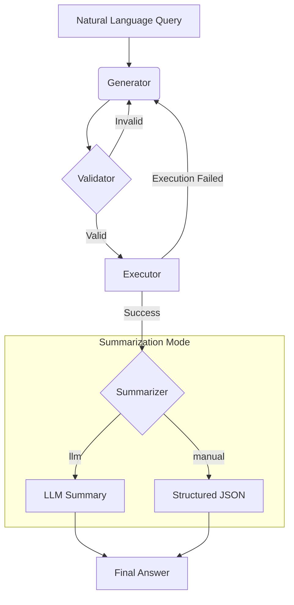

# Service Topology Agent with LangGraph

This project implements an intelligent agent using LangChain and LangGraph that understands natural language questions about **service topology**, converts them into Cypher queries, executes them against a Neo4j database, and returns a user-friendly result.

The agent is designed with a modular architecture, making it easy to extend and maintain.

## Core Features

- **Natural Language to Cypher**: Translates questions like "Which services depend on the API gateway?" into precise Cypher queries.
- **Two-Stage Validation**:
    1.  **LLM Pre-Validation**: An LLM checks the generated Cypher for syntax errors before execution.
    2.  **Database Execution**: The query is run against Neo4j, which serves as the ultimate validator.
- **Automatic Retries**: If either validation or execution fails, the agent attempts to correct the query automatically, retrying up to 3 times.
- **Dual Summarization Modes**:
    - **`llm` mode**: Provides a natural language summary of the results, perfect for human users.
    - **`manual` mode**: Formats the results into a structured JSON object, ideal for frontend applications or other programs.

## Workflow

The agent follows a robust, multi-step process to ensure accuracy and provide a great user experience.



## Architecture

The project is organized into a modular structure for clarity and scalability:

- `main.py`: The main entry point of the application.
- `agent.py`: The core `Text2CypherAgent` class that assembles and orchestrates all components.
- `agent_state.py`: Defines the shared `GraphState` for the entire workflow.
- `nodes/`: Contains individual, single-responsibility nodes for the graph.
    - `cypher_generator.py`: Generates the initial Cypher query (LLM 1).
    - `cypher_validator.py`: Validates the query's syntax (LLM 2).
    - `query_executor.py`: Executes the query against Neo4j.
    - `summarizer_node.py`: Summarizes results using an LLM.
    - `manual_summarizer_node.py`: Formats results using predefined logic.
- `tools/`: Holds clients for external services.
    - `llm_client.py`: Initializes the connection to the OpenAI API.
    - `neo4j_client.py`: Manages the connection to the Neo4j database.
- `prompts/`: Manages all prompt-related logic.
    - `prompt_manager.py`: Loads and formats prompt templates and examples.
- `examples.json`: Stores few-shot examples for the prompt, making it easy to improve the agent without changing code.

## Setup Instructions

### 1. Environment Setup

It is recommended to use a virtual environment.

```bash
# Create a virtual environment
python -m venv venv

# Activate it
# On macOS/Linux:
source venv/bin/activate
# On Windows:
.\\venv\\Scripts\\activate
```

### 2. Install Dependencies

```bash
pip install -r requirements.txt
```

### 3. Configure Environment Variables

Create a `.env` file in the project's root directory by copying `.env.example`. Then, fill in your OpenAI and Neo4j credentials.

```
# .env file

# OpenAI API Key
OPENAI_API_KEY="your_openai_api_key"

# Neo4j Credentials
NEO4J_URI="bolt://localhost:7687"
NEO4J_USERNAME="neo4j"
NEO4J_PASSWORD="your_neo4j_password"
```
**Note**: Ensure your Neo4j database is running and accessible.

## How to Run

1.  **Choose a Summarizer**: Open `main.py` and set the `summarizer_choice` variable to either `'llm'` or `'manual'`.
2.  **Run the script**:

    ```bash
    python main.py
    ```

You can change the `natural_language_query` variable in `main.py` to ask your own questions about your service topology.

## Improving the Agent

To improve the agent's accuracy, you don't need to change the code. Simply add new, high-quality examples of "natural language -> Cypher" pairs to the `examples.json` file. The agent will automatically use them in its prompts on the next run. 